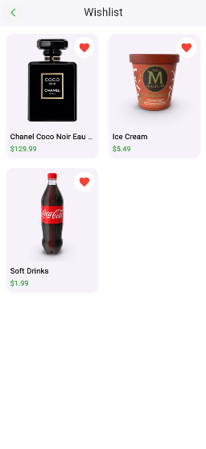

# Flutter E-Commerce App

A **modern Flutter e-commerce application** built using the [DummyJSON API](https://dummyjson.com/), featuring authentication, product listing, wishlist, cart management, and profile handling — all wrapped in a **beautiful green-themed UI**.

---

## Overview

**Green Shop** is a fully responsive, cleanly architected Flutter app showcasing:
- Authentication flow (Login & Logout)
- Product listing with pagination
- Product detail with cart and wishlist actions
- Quantity management with total price calculation
- Profile page fetched via access token
- Local persistence using Shared Preferences
- Loading and error handling with graceful UI feedback

---

## App Screenshots
| Splash | Login | Product List | Product Detail |
|:------:|:------:|:-------------:|:---------------:|
|  |  |  |  |

| Wishlist | Cart | Profile | Loading |
|:---------:|:----:|:---------:|:---------:|
|  |  |  |  |

---

## Tech Stack

- **Flutter** – Cross-platform framework
- **Provider** – State management
- **HTTP** – API communication
- **Shared Preferences** – Local storage
- **DummyJSON API** – Mock REST API for products & authentication

---

## Folder Structure

```
lib/
 ├── core/
 │    ├── api/
 │    │     └── api_client.dart       
 │    ├── utils/
 │    │     └── app_constants.dart
 │    └── storage/
 │          └── local_storage.dart   
 │
 ├── features/
 │    ├── auth/
 │    │     ├── models/user_model.dart
 │    │     ├── services/auth_service.dart
 │    │     ├── providers/auth_provider.dart
 │    │     └── screens/login_screen.dart
 │    │
 │    ├── products/
 │    │     ├── models/product_model.dart
 │    │     ├── services/product_service.dart
 │    │     ├── providers/product_provider.dart
 │    │     ├── screens/product_list_screen.dart
 │    │     └── screens/product_detail_screen.dart
 |    |
 │    ├── product_details/
 │    │     ├── models/product_details_model.dart
 │    │     ├── services/product_detail_service.dart
 │    │     ├── providers/product_detail_provider.dart
 │    │     └── screens/product_detail_screen.dart
 │    │
 │    ├── wishlist/
 │    │     ├── providers/wishlist_provider.dart
 │    │     └── screens/wishlist_screen.dart
 │    │
 │    └── cart/
 │          ├── providers/cart_provider.dart
 │          └── screens/cart_screen.dart
 │
 ├── widgets/
 │     ├── product_tile.dart
 │     └── product_shimmer.dart
 │
 ├── main.dart
 └── splash_screen.dart                          

```

This modular structure ensures **clean separation of concerns** and **maintainable scaling** for future features.

---

## Getting Started

### Prerequisites
- Flutter SDK (>=3.0)
- Android Studio / VS Code
- A physical device or emulator

### Installation

```bash
# Clone this repository
git https://github.com/Muneef-Nk/dummyshop_flutter

# Move into project folder
cd dummyshop_flutter

# Get dependencies
flutter pub get

# Run the app
flutter run
```

---

## Authentication Flow

- Users log in using credentials from the DummyJSON API  
  *(Example: `username: kminchelle`, `password: 0lelplR`)*  
- Access Token is stored securely using Shared Preferences.  
- Authenticated routes (Profile, Wishlist, Cart) require a valid token.

---

## Features Implemented

 - Login with access token validation  
- Fetch & display authenticated user profile  
- Product listing with pagination  
- Product details with images & quantity control  
- Wishlist with local storage persistence  
- Cart management with quantity and total calculation  
- Beautiful, responsive green UI/UX  
- Loading, shimmer effects, and error handling  
- Organized Provider-based state management  
- Clean commit history and documentation


